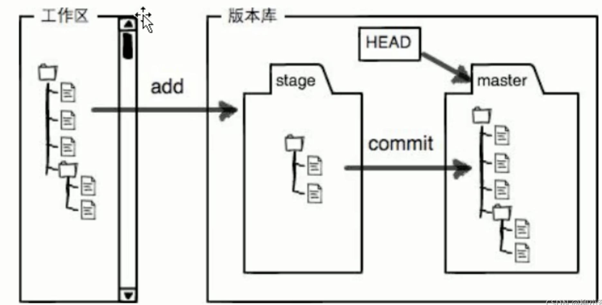

# Git 专业名词概述
- **Repository (仓库)**: 用于存储项目的代码和版本历史的地方。
- **Commit (提交)**: 保存代码更改的快照，包含描述信息。
- **Branch (分支)**: 项目开发的独立线，用于并行工作。
- **Merge (合并)**: 将分支的更改整合到另一个分支中。
- **Remote (远程仓库)**: 托管在服务器上的仓库，例如 GitHub。
- **Clone (克隆)**: 从远程仓库复制项目到本地。
- **Pull (拉取)**: 从远程仓库获取最新更改并合并到本地。
- **Push (推送)**: 将本地更改上传到远程仓库。
- **Staging Area (暂存区)**: 准备提交的文件区域。
- **Working Directory (工作区)**: 当前正在编辑的项目文件夹。

# Git的前世
git的诞生和linux是分不开的，linux是开源系统，需要很多开发者来开发和维护，这避免不了有很版本的迭代和更新，git就是这样一个工具，它能够保存代码的各个版本，每个版本文件的修改，删除，Git 都会跟踪，以便任何时候都可以追踪历史或者在将来某一时刻可以还原。

说的通俗易懂一点：git可以帮助你记录每一次代码改动的情况，你可以随时恢复、复制某一时刻你写的代码。

# Git原理简介
Git 是一个分布式版本控制系统，它的核心原理是通过快照记录代码的每个状态。每次提交（Commit）都会保存当前代码的快照，并生成一个唯一的标识。开发者可以在分支（Branch）上独立工作，分支之间的更改可以通过合并（Merge）整合。Git 的分布式特性允许本地和远程仓库（Remote）协同工作，开发者可以通过拉取（Pull）和推送（Push）与团队同步代码。暂存区（Staging Area）则是提交前的缓冲区，用于组织和准备代码变更。

# Git 常用命令合集

## 基本操作
- **初始化仓库**: `git init`
- **克隆远程仓库**: `git clone <repository-url>`
- **查看仓库状态**: `git status`
- **添加文件到暂存区**: `git add <file>` 或 `git add .`
- **提交更改**: `git commit -m "提交信息"`

## 分支管理
- **查看分支**: `git branch`
- **创建分支**: `git branch <branch-name>`
- **切换分支**: `git checkout <branch-name>` 或 `git switch <branch-name>`
- **创建并切换分支**: `git checkout -b <branch-name>` 或 `git switch -c <branch-name>`
- **删除分支**: `git branch -d <branch-name>`

## 远程操作
- **查看远程仓库**: `git remote -v`
- **添加远程仓库**: `git remote add <name> <url>`
- **拉取远程更改**: `git pull <remote> <branch>`
- **推送本地更改**: `git push <remote> <branch>`

## 合并与冲突
- **合并分支**: `git merge <branch-name>`
- **解决冲突后继续合并**: 编辑冲突文件后，`git add <file>`，然后 `git commit`

## 历史查看
- **查看提交历史**: `git log`
- **查看简洁历史**: `git log --oneline`
- **查看某文件的更改历史**: `git log <file>`

## 撤销操作
- **撤销暂存区的更改**: `git reset <file>`
- **撤销工作区的更改**: `git checkout -- <file>`
- **回退到某次提交**: `git reset --hard <commit-hash>`

## 标签管理
- **创建标签**: `git tag <tag-name>`
- **查看标签**: `git tag`
- **推送标签到远程**: `git push origin <tag-name>`

## 其他
- **查看差异**: `git diff`
- **清理未跟踪文件**: `git clean -f`
- **配置用户名和邮箱**: 
    - `git config --global user.name "Your Name"`
    - `git config --global user.email "your.email@example.com"`